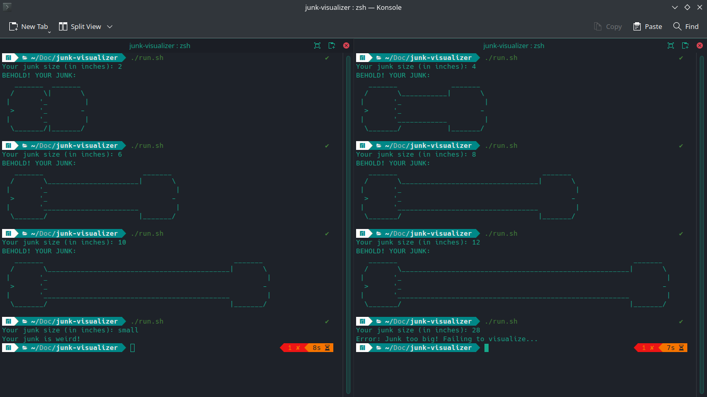

# Junk Visualizer

It does exactly what the title says it does. <br><br>
Inspired from a friend's python project:

```python
print(f"Your pinus: 8{int(input('Enter the length of your pinus: '))*'='}D")
```

## Preview



## Usage

- Compile the `code.c` file.
- Or simply use `./app` or `./run.sh` if you are on a linux machine.
- Measure your junk's size with a measuring tape.
- Make sure the measurement is in inches.
- Run the compiled file of the code.
- Enter your measurement result.
- Sit back and enjoy the visuals.

## Caution

- The visualizer may not accurately render your junk for certain sizes!
- The [MIT License](LICENSE), while a beacon of freedom, is not a shield against legal woes. Tread carefully, for the path of open source is paved with both opportunity and litigation. And something like the junk visualizer can be dangerous when misused.
